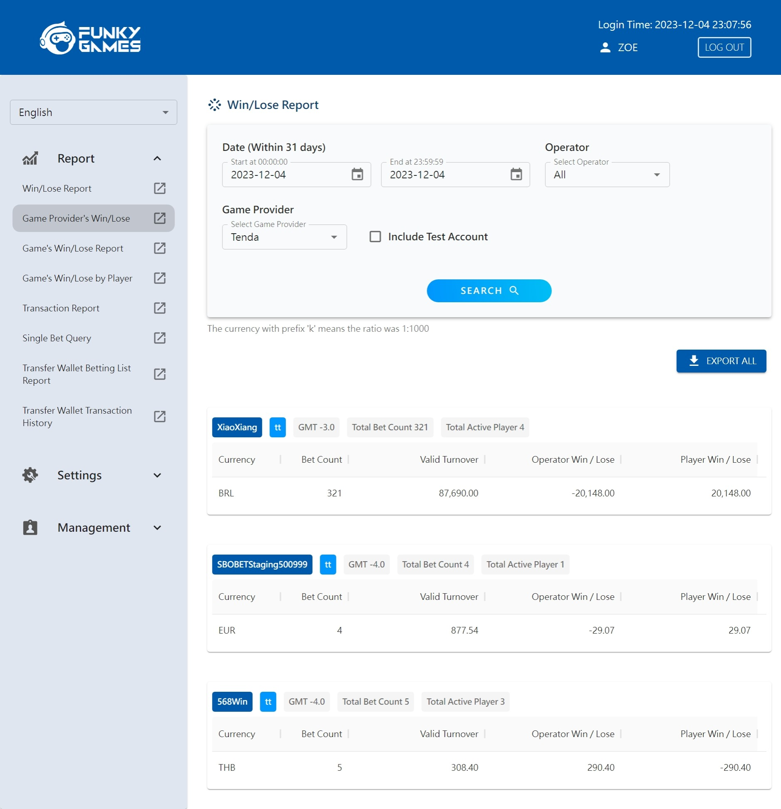

<!-- _paginate: false-->

# <!--fit-->Promotion E10

---

# Problems
# Solutions -> Outcomes
# Cases

---

# Vikings 的困境
## 產品交付速度慢
## 維運負擔重

---
 
<!-- _header: Vikings 的困境 -->

# 產品交付速度慢

> ### 前端與主流技術脫節，團隊無法維運，公車指數低
>
> ### 前後端程式一起開發，增加開發的複雜度與人為錯誤率
>
> ### 難以運用外部設計資源，新 feature 自己切版就要 1 Sprint
> 
> ### 前端難以使用現成資源，預估新 feature 要花上 2 Sprint
>
> ### 其他成員無法協助，造成 Sprint fail

<!-- _footer: Problems -->

---
 
<!-- _header: 維運負擔重 -->

# 維運負擔重

> ### 人工流程多，維運不易，出錯率高
>
> ### 後台工具四散各處，增加維護成本
>
> ### 各方都在修改同個系統，增加出錯機率
>
> ### 重大 Issue 的後續處理程序麻煩，容易造成連帶影響
>

<!-- _footer: Problems -->

---

<!-- _header: 前端產品的問題 -->

# Solutions

---

# 1. 重寫前端架構

> ### 團隊能夠維運現有產品，公車指數上升
>
> ### 前後端程式分離，開發中的錯誤與衝突降為 0 
>
> ### 運用外部設計資源，新 feature 切版只花 0.5 天
> 
> ### 使用外部現成工具，重構與新 feature 只花 1 Sprint
>
> ### 團隊能夠共同開發前端，幫助 Sprint 成功
>
> ### 方便增加後台工具，降低維運負擔與出錯率

<!-- _footer:  Solutions -->

---
<!-- _header: 重寫前端架構 -->
>*Analyze possible solutions*, *Independent and self-directed*, 
*Positive impact*, *Major contributions/impact to Product & Team*

#### 選擇部門常用技術 -> 便於部門交流與互相支援
#### 選擇易於使用、文件完整的套件 -> 降低團隊的認知負擔，建立信心
#### 功能完整的套件 -> 提供 PO 更多選項，提升使用者體驗
#### 容易添加新功能 -> 優化開發與維運速度，新 feature 只花 1~2 天
#### 生態圈活躍 -> 技術持續支援，減輕維運壓力

<!-- _footer:  Solutions -->

---

# 2. 提升團隊前端能力
> ### 團隊能夠維運前端，持續提高公車指數
>
> ### 團隊共同開發，Sprint 成功率上升
>
> ### 自由增添後台工具，降低維運負擔與出錯率
> 
<!-- _footer:  Solutions -->

---

<!-- _header: 提升團隊前端能力 -->
>*Positive impact*, *Provide guidance/training*,
*Major contributions/impact to Product & Team*

#### 解說基本前端知識 -> 建立基本概念
#### 與成員 Pair 前端 -> 熟悉前端框架、運作模式 
#### Code Review 著重注意事項與應用重點 -> 團隊能夠處理 50% 前端 item
#### 分享前端新技術方向 -> 讓團隊了解前端最新發展，討論技術選擇
#### 前端教學 -> 可以處理簡單的前端 issue

<!-- _footer:  Solutions -->

---
 

# 3. 提升個人 E2E 能力
 
>*Independent and self-directed*, *Positive impact*,
 *Major contributions/impact to Team*
 
#### 協助設計後台管理畫面 -> 節省等待設計稿時間，協助團隊快速交付產品

<!-- _footer:  Solutions -->
---
# 4. 自動化
>*Independent and self-directed*,  *Strong knowledge*,
 *Major contributions/impact to Product*

#### 撰寫維運工具 -> 降低 Issue 查找與處理的時間

<!-- _footer:  Solutions -->

---

<!-- _header: Vikings 的開發瓶頸 -->

# BO Site & 後台

#### 經過架構重寫
  - 新頁面開發時間，**從三天到半天**
  - 畫面元素重複使用，切版時間**從 2 天降為 1 小時**
  - 新人可以直接上手
  - 添加維運小工具的難度降低許多
 

  >*Analyze possible solutions*, *Independent and self-directed*,

<!-- _footer:  Case -->

---
<!-- _header: Vikings 的開發瓶頸 -->

# BO Site & 後台

#### 提升團隊前端能力
  - 成員可以獨立完成
  - 簡單小問題的修復
  - 後台工具添加容易
 

> *Make positive impact to the team*,
> *Provide guidance/training to Juniors*

<!-- _footer:  Case -->
---

# Check sum API

#### 撰寫維運工具
  - 錯帳時，同步兩邊資料的成本，
    從 PD 操作 1 小時，**處理 1 天的注單量**，
    到 PD 執行程式，**每小時處理 9 天的注單量**
  

 

> *Independent and self-directed*, *Strong Knowledge*,
> *Make positive impact to the Product*

<!-- _footer:  Case -->

---

# 維運官網
> ## 載入速度過慢，推廣成效打折
>
> ## 與 ID 合作經常重工
>
> ## ID 與 Vikings 開發習慣不同，產品開發 Guideline 不明確

---

<!-- _header: 維運官網 -->

# Solutions

- 優化圖片載入速度
  效能分數從 **40 至 90 以上**
- 與 ID 明定開發流程
  重工次數 **3 降為 0**
- 與 ID Code Review，並溝通開發習慣
  **維持程式一致品質**

---

# 挑戰

## 1.  前端教學
## 2.  UI UX
 
---
# <!--fit-->持續學習
---
# 補充

---

<!-- _header: Funky 帳務系統的維運負擔 -->

## Rebate setting
- 自己設計畫面，**1 sprint 完成**

<!-- _footer: Case -->

---

<!-- _header: Funky 帳務系統的維運負擔 -->

## 發票
- 提出第一階段維運問題，**第二階段獲得解決**
- 開發前端頁面，根據維運經驗，**幫助 PO 簡化 GP 設定流程**
- **獨立開發** GP 發票設定功能

<!-- _footer: Case -->

---
 

<!-- _header: Vikings 的開發瓶頸 -->

# Remain Rollover

- 增加並簡化各個活動的 Remain Rollover 計算規則
- 測試保護
- 向 Akira 講解 Domain

>*Analyze possible solutions*,
>*Strong knowledge*,
>*Independent and self-directed*,
>*Positive impact*

<!-- _footer:  Case -->
---

<!-- _header: Funky 帳務系統的維運負擔 -->

## 匯率

- 更新程式並增加畫面，簡化流程
  **減少 80% 補缺的時間**
- 優化更新匯率功能
  **XE 使用次數從所有幣別節省為單一幣別**
- 另外處理客製化的幣別，預防人為疏失
  **停止占用 XE 使用次數**
  **避免人工複製的操作錯誤**
<!-- _footer: Case -->

---

<!-- _header: Vikings 的開發瓶頸 -->

# 介接 VA 與 AK

- 來回溝通確認雙方的認知差距
  **AK 文件前後矛盾**
- 請第三方更改 Spec 回傳必要參數
  **降低我方系統的複雜度**
- 開發 Resettle 流程
  
>*Strong knowledge*,
>*Independent and self-directed*,
>*Positive impact*,

 <!-- _footer:  Case -->
